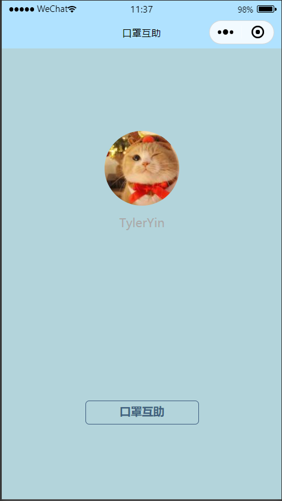

# Mask Helper -- Documentation

## 项目初衷

随着后疫情时代的到来和秋冬季节疫情恶化的趋势，虽然人们戴口罩的场景相比于最开始已经缩减了很多，但仍有很多情形下，会面临需要口罩等防疫物资却忘记携带的窘境。基于这种情况，我们希望帮助这部分陷入窘境的人们及时有效地获取到自己缺失的物资，并且借此发扬疫情背景下人与人之间的互助精神。

## 设计思路

### 程序载体

我们使用微信小程序作为程序载体，这主要是因为微信的用户群体庞大，基于微信的小程序可以实现跨平台的特性，快速吸引目标用户且免去了冗余的安装步骤。

### 用户界面

用户界面力求简洁美，在涵盖所需功能的前提下避免添加冗余的页面和按键，以免影响观感。

所以用户界面被分为两个核心部件：主页面上方是一块基于实时定位的地图，显示当前用户所在位置和愿意提供口罩帮助的用户位置等；主页面下方是两个交互按钮，分别代表发出口罩求助和接到求助并愿意提供帮助的信号。然后上面的三个图标一个表示刷新周围用户的位置，点击之后可以获得周围的用户，中间的表示导航功能，在求助者与帮助者匹配之后可以得到导航，最右边的是定位功能，能够更新自身的定位。

另外点击“求助状态”可以得到目前自身的状态：

## 实现方式 

用户发出借口罩的信息后向服务器发送请求，服务器接受来自其他用户的送口罩信息，距离更近、时间更早的帮助会被赋予更高的优先级，并为双方提供导航信息。

## 使用说明

当想要发布口罩求助时，点击左下方按钮，会发出信号提示周边其余用户新增需要口罩的请求；

当收到需要口罩的请求后，如果拥有口罩并愿意帮助，就可以点击右下方按钮，示意对方自己的位置并完成交换。

## 参考资料 

[微信开放文档](https://developers.weixin.qq.com/miniprogram/dev/framework/)

[微信小程序入门教程(ruanyifeng.com)](http://www.ruanyifeng.com/blog/2020/10/wechat-miniprogram-tutorial-part-one.html)

